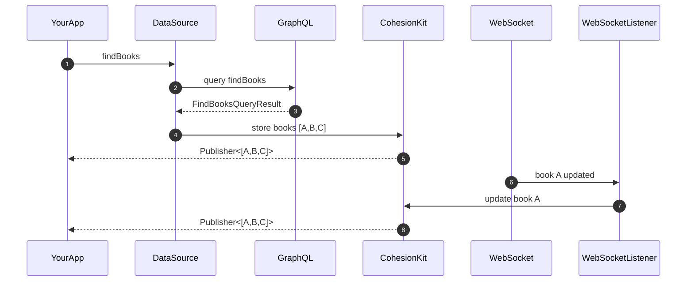

# CohesionKit - Single Source of Truth

<p>
  
  
  
  <a href="https://twitter.com/pjechris">
    
  </a>
</p>

Keep your models synchronized in your app and never have any inconsistency anymore. Designed using latest Swift features.

## Why using CohesionKit?

- 🔁 You need realtime synchronisation (websockets)
- 🌐 You have multiple data sources (REST, CoreData, websocket, phone Contacts, Google Maps, etc...)
- 🪶 You look for a full Swift lightweight tool
- 🗃️ You want to use structs

### Features

- [x] 🦺 Thread safe
- [x] 🪶 Lighweight (< 600 lines of code)
- [x] 🪪 Working with plain Swift `struct` and `Identifiable` objects
- [x] 🔀 Support for Combine
- [x] 🧠 In-memory storage
- [x] 🐾 Low memory footprint
- [x] 🐪 Strongly typed

### Where to put CohesionKit in my stack?

CohesionKit being a Single Source of Truth solution it handles your objects lifecycle and synchronization from *any* source.

You should put CohesionKit in front of your data sources (REST API, GraphQL, ...) before returning data to your app.




## Installation

- Swift Package Manager

```swift
dependencies: [
    .package(url: "https://github.com/pjechris/CohesionKit.git", .upToNextMajor(from: "0.7.0"))
]
```

## Examples

Library comes with an [example project](https://github.com/pjechris/CohesionKit/tree/main/Example) so you can see a real case usage. It mostly shows:

- How to store data in the library
- How to retrieve and update that data for realtime
- How data is synchronised throughout multiple screens

## Getting started

### Storing an object

First create an instance of `EntityStore`:

```swift
let entityStore = EntityStore()
```

`EntityStore` let you store `Identifiable` objects:

```swift
struct Book: Identifiable {
  let id: String
  let title: String
}

let book = Book(id: "ABCD", name: "My Book")

entityStore.store(book)
```

Then You can retrieve the object from anywhere in your code:

```swift
// somewhere else in the code
entityStore.find(Book.self, id: "ABCD") // return Book(id: "ABCD", name: "My Book")
```

### Observing changes

Every time data is updated in `EntityStore` triggers a notification to any registered observer. To register yourself as an observer just use result from `store` or `find` methods:

```swift
func findBooks() -> some Publisher<[Book], Error> {
  // 1. load data using URLSession
  URLSession(...)
  // 2. store data inside our entityStore
    .store(in: entityStore)
    .sink { ... }
    .store(in: &cancellables)
}
```

```swift
entityStore.find(Book.self, id: 1)?
  .asPublisher
  .sink { ... }
  .store(in: &cancellables)
```

> CohesionKit has a [weak memory policy](#weak-memory-management) you should read about. As such, returned value from entityStore.store must be strongly retained to not lose value.

> For brievety, next examples will omit `.sink { ... }.store(in:&cancellables)`.

### Relational objects

To store objects containing nested identity objects you need to make them conform to one protocol: `Aggregate`.

```swift
struct AuthorBooks: Aggregate {
  var id: Author.ID { author.id }

  var author: Author
  var books: [Book]

  // `nestedEntitiesKeyPaths` must list all Identifiable/Aggregate this object contain
  var nestedEntitiesKeyPaths: [PartialIdentifiableKeyPath<Self>] {
    [.init(\.author), .init(\.books)]
  }
}
```

CohesionKit then handles synchronisation for the three entities:

- AuthorBook
- Author
- Book

> Only writable keypath are accepted. Using a KeyPath (let) will result in error: "Key path value type KeyPath<XX> cannot be converted to contextual type WritableKeyPath<XX>"

This gives you the ability to retrieve them independently from each other:

```swift
let authorBooks = AuthorBooks(
    author: Author(id: 1, name: "George R.R Martin"),
    books: [
      Book(id: "ACK", title: "A Clash of Kings"),
      Book(id: "ADD", title: "A Dance with Dragons")
    ]
)

entityStore.store(authorBooks)

entityStore.find(Author.self, id: 1) // George R.R Martin
entityStore.find(Book.self, id: "ACK") // A Clash of Kings
entityStore.find(Book.self, id: "ADD") // A Dance with Dragons
```

You can also modify any of them however you want. Notice the change is visible from the object itself AND from aggregate objects:

```swift
let newAuthor = Author(id: 1, name: "George R.R MartinI")

entityStore.store(newAuthor)

entityStore.find(Author.self, id: 1) // George R.R MartinI
entityStore.find(AuthorBooks.self, id: 1) // George R.R MartinI + [A Clash of Kings, A Dance with Dragons]
```

> You might think about storing books on `Author` directly (`author.books`). In this case `Author` needs to implement `Aggregate` and declare `books` as nested entity.
>
> However I strongly advise you to not nest `Identifiable` objects into other `Identifiable` objects. Read [Handling relationships](https://swiftunwrap.com/article/modeling-done-right/) article if you want to know more about this subject.

### Storing vs Updating

For now we only focused on `entityStore.store` but CohesionKit comes with another method to store data: `entityStore.update`.

Sometimes both can be used but they each have a different purpose:

1. `store` is suited for storing full data retrieved from webservices, like `GET /user` for instance
2. `update` is usually used for partial data. It's also the preferred method when receiving events from websockets.

## Advanced topics

### Enum support

Starting with 0.13 library has support for enum types. Note that you'll need to conform to `EntityWrapper` and provide computed getter/setter for each entity you'd like to store.

```swift
enum MediaType: EntityWrapper {
  case book(Book)
  case game(Game)
  case tvShow(TvShow)

  func wrappedEntitiesKeyPaths<Root>(relativeTo parent: WritableKeyPath<Root, Self>) -> [PartialIdentifiableKeyPath<Root>] {
    [.init(parent.appending(\.book)), .init(parent.appending(\.game)), .init(parent.appending(\.tvShow))]
  }

  var book: Book? {
    get { ... }
    set { ... }
  }

  var game: Game? {
    get { ... }
    set { ... }
  }

  var tvShow: TvShow? {
    get { ... }
    set { ... }
  }
}

struct AuthorMedia: Aggregate {
  var author: Author
  var media: MediaType

  var nestedEntitiesKeyPaths: [PartialIdentifiableKeyPath<Self>] {
    [.init(\.author), .init(wrapper: \.media)]
  }
}
```

### Aliases

Sometimes you need to retrieve data without knowing the object id. Common case is current user.

CohesionKit provides a suitable mechanism: aliases. Aliases allow you to register and find entities using a key.

```swift
extension AliasKey where T == User {
  static let currentUser = AliasKey("user")
}

entityStore.store(currentUser, named: .currentUser)
```

Then request it somewhere else:

```swift
entityStore.find(named: .currentUser) // return the current user
```

Compared to regular entities, aliased objects are long-live objects: they will be kept in the storage **even if no one observes them**. This allow registered observers to be notified when alias value change:

```swift
entityStore.removeAlias(named: .currentUser) // observers will be notified currentUser is nil.

entityStore.store(newCurrentUser, named: .currentUser) // observers will be notified that currentUser changed even if currentUser was nil before
```

### Stale data

When storing data CohesionKit actually require you to set a modification stamp on it. `Stamp` is used as a marker to compare data freshness: the higher stamp is the more recent data is.

By default CohesionKit will use the current date as stamp.

```swift
entityStore.store(book) // use default stamp: current date
entityStore.store(book, modifiedAt: Date().stamp) // explicitly use Date time stamp
entityStore.store(book, modifiedAt: 9000) // any Double value is valid
```

If for some reason you try to store data with a stamp lower than the already stamped stored data then the update will be discarded.

### Weak memory management

CohesionKit has a weak memory policy: objects are kept in `EntityStore` as long as someone use them.

To that end you need to retain observers as long as you're interested in the data:

```swift
let book = Book(id: "ACK", title: "A Clash of Kings")
let cancellable = entityStore.store(book) // observer is retained: data is retained

entityStore.find(Book.self, id: "ACK") // return  "A Clash of Kings"
```

If you don't create/retain observers then once entities have no more observers they will be automatically discarded from the storage.

```swift
let book = Book(id: "ACK", title: "A Clash of Kings")
_ = entityStore.store(book) // observer is not retained and no one else observe this book: data is released

entityStore.find(Book.self, id: "ACK") // return nil
```

```swift
let book = Book(id: "ACK", title: "A Clash of Kings")
var cancellable = entityStore.store(book).asPublisher.sink { ... }
let cancellable2 = entityStore.find(Book.self, id: "ACK") // return a publisher

cancellable = nil

entityStore.find(Book.self, id: "ACK") // return "A Clash of Kings" because cancellable2 still observe this book
```

# License

This project is released under the MIT License. Please see the LICENSE file for details.
